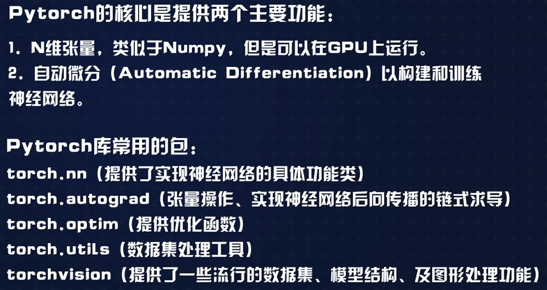

# 一、pytorch 环境搭建
## 主要特点
    Keras是Tensorflow推荐的神经网络高层API，其对后端的封装程度高，易用性好，可以非常方便地构建神经网络。需要注意，Keras本身不是神经网络框架，而是高层API，它支持以Tensorflow、Theano等神经网络框架为后端，简化实现细节，实现高层封装，代码非常简洁。
    Pytorch可以以看做是支持GPU的numpy，相对于Keras，它支持更自由地编写神经网络层、查看数值优化任务等，在灵活性上要比Keras好一些。根据对比测试结果，二者在模型性能上相差不大。
    Keras更简洁，而Pytorch更灵活:两种主流框架以其各自的特点分别受到了业界和学界的欢迎
## 主要功能

## 环境搭建
### 离线下载地址
    https://download.pytorch.org/whl/torch_stable.html
### 文档
    https://pytorch.apachecn.org/