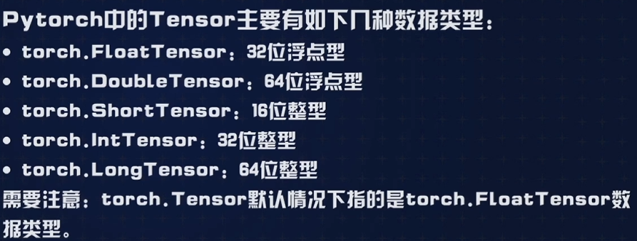
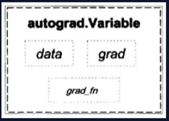
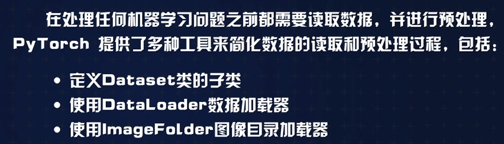
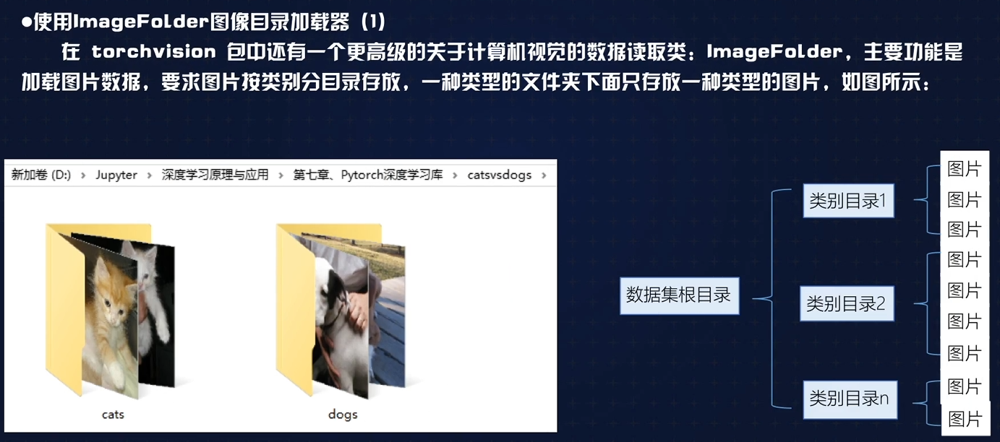

# 一、pytorch 环境搭建
## 主要特点
    Keras是Tensorflow推荐的神经网络高层API，其对后端的封装程度高，易用性好，可以非常方便地构建神经网络。需要注意，Keras本身不是神经网络框架，而是高层API，它支持以Tensorflow、Theano等神经网络框架为后端，简化实现细节，实现高层封装，代码非常简洁。
    Pytorch可以以看做是支持GPU的numpy，相对于Keras，它支持更自由地编写神经网络层、查看数值优化任务等，在灵活性上要比Keras好一些。根据对比测试结果，二者在模型性能上相差不大。
    Keras更简洁，而Pytorch更灵活:两种主流框架以其各自的特点分别受到了业界和学界的欢迎
## 主要功能

## 环境搭建
### 离线下载地址
    https://download.pytorch.org/whl/torch_stable.html
### 安装包
    torch-2.3.0+cu118-cp312-cp312-win_amd64.whl
    torchaudio-2.3.0+cu118-cp312-cp312-win_amd64.whl
    torchvision-0.18.0+cu118-cp312-cp312-win_amd64.whl
### 文档
    https://pytorch.apachecn.org/

# pytorch中的tensor

## Variable对象
    1.神经网络在做运算的时候需要先构造一个计算图，然后在里面进行前向传播和反向传播，传播过程中通过求导以获得梯度。不同于编程语言中的变量，pytorch中的Variable(变量)是神经网络计算图里中一个特殊概念，提供了自动求导功能。
    2.在Pytorch中，Variable 利Tensor本质上没有区别，不过Variable 可以被放人一个计算图中，然后进行前向传播，反向传播，自动求导， 
    3.Variable的结构包括三部分:data即Variable中的Tensor数值;grad fn是得到这个Variable的操作，比如加减或乘除;grad是这个Variable的反向传播梯度。

## 叶节点
    由用户直接创建的计算图Variable对象
    叶子节点的梯度在反向传播后会被保留
# pytorch 中数据集相关类

## DataLoader（数据装载器）
    DataLoader会构建一个可迭代的数据装载器，在训练过程中将白定义的数据集根据batch size大小、是否shuffle等封装成一个又一个batch大小的Tensor数据给模型进行训练和测试。
    常用参数：dataset(加载数据的数据集)、batch size(每个batch加载多少个样本)shuffle(是否随机打乱顺序)、num workers(使用多少个子线程加载数据)
## ImageFolder（图像目录加载器）
    ImageFolder类可以读取按目录分类存放的图像数据，建立数据集，
    from torchvision.datasets import ImageFolder
